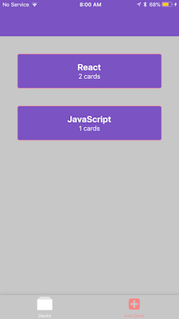
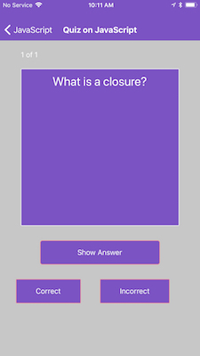
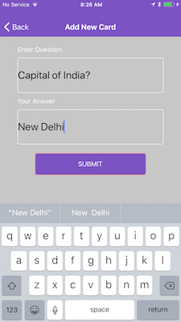

## Specific Requirements

Use create-react-native-app to build your project.

Allow users to create a deck which can hold an unlimited number of cards.

Allow users to add a card to a specific deck.

The front of the card should display the question.

The back of the card should display the answer.

Users should be able to quiz themselves on a specific deck and receive a score once they're done.

Users should receive a notification to remind themselves to study if they haven't already for that day.

This project was bootstrapped with [Create React App](https://github.com/facebookincubator/create-react-app).

Used [Flip Card Animation](https://codedaily.io/screencasts/12/Create-a-Flip-Card-Animation-with-React-Native)  

## Installation and Launching

clone the Project - git clone https://github.com/sonalikatara/mobile-flashcards

install the dependencies - npm install

start the project with yarn - yarn start

Select i for ios simulator (You will need to have Expo available). Alternatively you can scan the barcode on an Android (but there may be views unavailable in Android)

Play around and have fun on the simulator (Best to view using iPhone 8 )

## The Views

The application has five views.

### Deck List View (Default View)

displays the title of each Deck

displays the number of cards in each deck

### Deck View List : Individual Deck View

displays the title of the Deck

displays the number of cards in the deck

displays an option to start a quiz on this specific deck

An option to add a new question to the deck

### Quiz View

displays a card question

an option to view the answer (flips the card)

a "Correct" button

an "Incorrect" button

the number of cards left in the quiz

Displays the percentage correct once the quiz is complete

### New Deck View

An option to enter in the title for the new deck

An option to submit the new deck title

### New Question View
An option to enter in the question

An option to enter in the answer

An option to submit the new question

## License

The contents of this repository are covered under the MIT License.